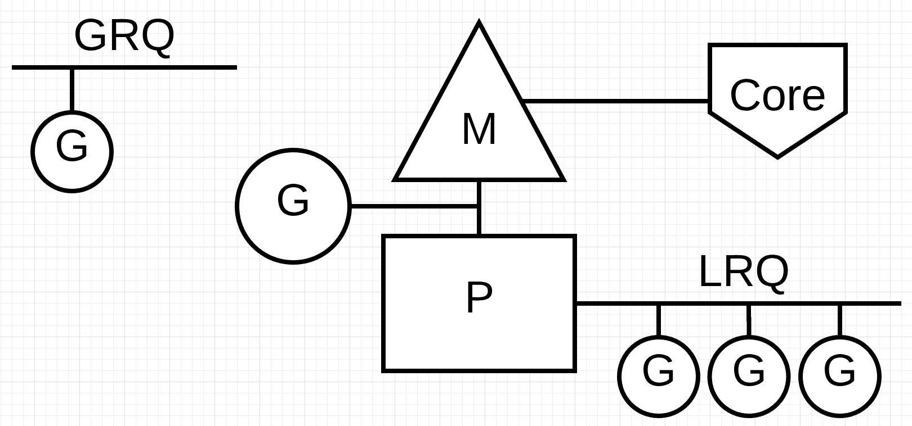
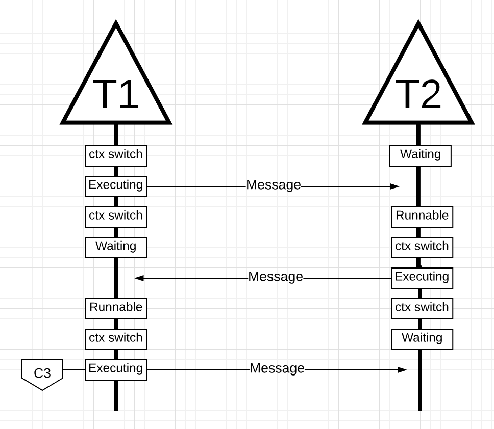
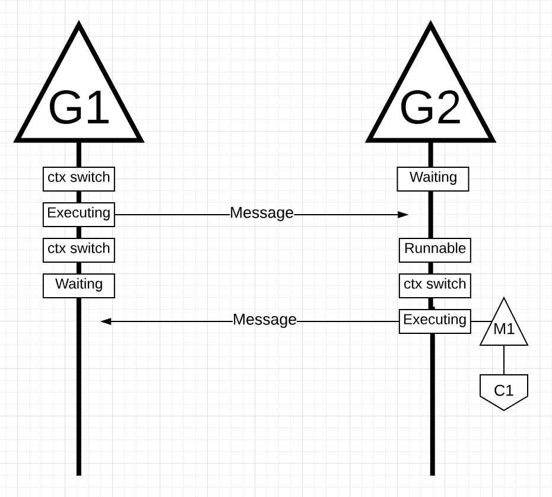

# Go Scheduler

Every P (Logical Processor) is assigned an OS Thread (“M”). The ‘M’ stands for machine. 
This Thread is still managed by the OS and the OS is still responsible for placing the Thread on a Core for execution. 

Every Go program is also given an initial Goroutine (“G”), which is the path of execution for a Go program. 
A Goroutine is essentially a Coroutine but this is Go, so we replace the letter “C” with a “G” and we get the word Goroutine. 
**Coroutines** are **cooperatively multitasked**, whereas threads are typically **preemptively**
You can think of Goroutines as application-level threads and they are similar to OS Threads in many ways.
Just as OS Threads are context-switched on and off a core, Goroutines are context-switched on and off an M.

The last piece of the puzzle is the run queues. 
There are two different run queues in the Go scheduler: the **Global Run Queue** (GRQ) and the **Local Run Queue (LRQ)**.
Each P is given a LRQ that manages the Goroutines assigned to be executed within the context of a P.
These Goroutines take turns being context-switched on and off the M assigned to that P.
The GRQ is for Goroutines that have not been assigned to a P yet.
There is a process to move Goroutines from the GRQ to a LRQ that we will discuss later.



## Cooperative multitasking
Cooperative multitasking, also known as non-preemptive multitasking, is a style of computer multitasking in which the operating system never initiates a context switch from a running process to another process. 
Instead, in order to run multiple applications concurrently, processes voluntarily yield control periodically or when idle or logically blocked.
This type of multitasking is called cooperative because all programs must cooperate for the scheduling scheme to work.

## Cooperating Scheduler
As we discussed in the first post, the OS scheduler is a preemptive scheduler.
Essentially that means you can’t predict what the scheduler is going to do at any given time.
The kernel is making decisions and everything is non-deterministic.

The Go scheduler is part of the Go runtime, and the Go runtime is built into your application.
This means the Go scheduler runs in user space, above the kernel.
The current implementation of the Go scheduler is not a preemptive scheduler but a cooperating scheduler.
Being a cooperating scheduler means the scheduler needs well-defined user space events that happen at safe points in the code to make scheduling decisions.


## Goroutine States
Just like Threads, Goroutines have the same three high-level states.
These dictate the role the Go scheduler takes with any given Goroutine. 
A Goroutine can be in one of three states: **Waiting**, **Runnable** or **Executing**.

**Waiting**: This means the Goroutine has stopped and waits for something in order to continue.
This could be for reasons like waiting for the operating system (system calls) or synchronization calls (atomic and mutex operations).
These types of latencies are a root cause for bad performance.

**Runnable**: This means the Goroutine wants time on an M so it can execute its assigned instructions.
If you have a lot of Goroutines that want time, then Goroutines have to wait longer to get time.
Also, the individual amount of time any given Goroutine gets is shortened as more Goroutines compete for time.
This type of scheduling latency can also be a cause of bad performance.

**Executing**: This means the Goroutine has been placed on an M and is executing its instructions.

## Context Switching
The Go scheduler requires well-defined user-space events that occur at safe points in the code to context-switch from.
There are four classes of events that occur in your Go programs that allow the scheduler to make scheduling decisions:

- The use of the keyword `go`
- Garbage collection
- System calls
- Synchronization and Orchestration

**The use of the keyword `go`**
The keyword go is how you create Goroutines. Once a new Goroutine is created, it gives the scheduler an opportunity to make a scheduling decision.

**Garbage collection**
Since the GC runs using its own set of Goroutines, those Goroutines need time on an M to run.
This causes the GC to create a lot of scheduling chaos.
However, the scheduler is very smart about what a Goroutine is doing and it will leverage that intelligence to make smart decisions.
One smart decision is context-switching a Goroutine that wants to touch the heap with those that don’t touch the heap during GC.
When GC is running, a lot of scheduling decisions are being made.

**System calls**
If a Goroutine makes a system call that will cause the Goroutine to block the M, sometimes the scheduler is capable of context-switching the Goroutine off the M and context-switch a new Goroutine onto that same M. 
However, sometimes a new M is required to keep executing Goroutines that are queued up in the P.
How this works will be explained in more detail in the next section.

**Synchronization and Orchestration**
If an atomic, mutex, or channel operation call will cause the Goroutine to block, the scheduler can context-switch a new Goroutine to run.
Once the Goroutine can run again, it can be re-queued and eventually context-switched back on an M

## Asynchronous System Calls
When the OS you are running on has the ability to handle a system call asynchronously, something called the [network poller](https://go.dev/src/runtime/netpoll.go) can be used to process the system call more efficiently.

Networking-based system calls can be processed asynchronously by many of the OSs we use today.
This is where the network poller gets its name, since its primary use is handling networking operations.
By using the network poller for networking system calls, the scheduler can prevent Goroutines from blocking the M when those system calls are made.
This helps to keep the M available to execute other Goroutines in the P’s LRQ without the need to create new Ms.
This helps to reduce scheduling load on the OS.

Example flow:

Goroutine-1 is executing on the M and there are 3 more Goroutines waiting in the LRQ to get their time on the M. The network poller is idle with nothing to do.


Goroutine-1 wants to make a network system call, so Goroutine-1 is moved to the network poller and the asynchronous network system call is processed.
Once Goroutine-1 is moved to the network poller, the M is now available to execute a different Goroutine from the LRQ. In this case, Goroutine-2 is context-switched on the M.


The asynchronous network system call is completed by the network poller and Goroutine-1 is moved back into the LRQ for the P.
Once Goroutine-1 can be context-switched back on the M, the Go related code it’s responsible for can execute again.
The big win here is that, to execute network system calls, no extra Ms are needed.


## Synchronous System Calls
What happens when the Goroutine wants to make a system call that can’t be done asynchronously?
In this case, the network poller can’t be used and the Goroutine making the system call is going to block the M.
This is unfortunate but there’s no way to prevent this from happening.
One example of a system call that can’t be made asynchronously is file-based system calls.

Example flow:

Goroutine-1 is going to make a synchronous system call that will block M1.


The scheduler is able to identify that Goroutine-1 has caused the M to block.
At this point, the scheduler detaches M1 from the P with the blocking Goroutine-1 still attached.
Then the scheduler brings in a new M2 to service the P.
At that point, Goroutine-2 can be selected from the LRQ and context-switched on M2.
If an M already exists because of a previous swap, this transition is quicker than having to create a new M.


The blocking system call that was made by Goroutine-1 finishes.
At this point, Goroutine-1 can move back into the LRQ and be serviced by the P again.
M1 is then placed on the side for future use if this scenario needs to happen again.


## Work Stealing
Another aspect of the scheduler is that it’s a work-stealing scheduler. This helps in a few areas to keep scheduling efficient.
For one, the last thing you want is an M to move into a waiting state because, once that happens, the OS will context-switch the M off the Core.
This means the P can’t get any work done, even if there is a Goroutine in a runnable state, until an M is context-switched back on a Core.
The work stealing also helps to balance the Goroutines across all the P’s so the work is better distributed and getting done more efficiently.

Example:

We have a multi-threaded Go program with two P’s servicing four Goroutines each and a single Goroutine in the GRQ.
What happens if one of the P’s services all of its Goroutines quickly?


P1 has no more Goroutines to execute.
But there are Goroutines in a runnable state, both in the LRQ for P2 and in the GRQ.
This is a moment where P1 needs to steal work. The rules for stealing work are as follows.

```go
runtime.schedule() {
    // only 1/61 of the time, check the global runnable queue for a G.
    // if not found, check the local queue.
    // if not found,
    //     try to steal from other Ps.
    //     if not, check the global runnable queue.
    //     if not found, poll network.
}
```


P1 needs to check P2 for Goroutines in its LRQ and take half of what it finds.
Half the Goroutines are taken from P2 and now P1 can execute those Goroutines.

What happens if P2 finishes servicing all of its Goroutines and P1 has nothing left in its LRQ?


P2 finished all its work and now needs to steal some. First, it will look at the LRQ of P1 but it won’t find any Goroutines.
Next, it will look at the GRQ. There it will find Goroutine-9.
P2 steals Goroutine-9 from the GRQ and begins to execute the work.
What is great about all this work stealing is that it allows the Ms to stay busy and not go idle.


## Practical Example - C vs Go Multithreaded

**C**

With the mechanics and semantics in place, I want to show you how all of this comes together to allow the Go scheduler to execute more work over time.
Imagine a multi-threaded application written in C where the program is managing two OS Threads that are passing messages back and forth to each other.

Example flow:

There are 2 Threads that are passing a message back and forth.
Thread 1 gets context-switched on Core 1 and is now executing, which allows Thread 1 to send its message to Thread 2.


as follows...


as follows...


All these context switches and state changes require time to be performed which limits how fast the work can get done.
With each context-switching potential incurring a latency of ~1000 nanoseconds, and hopefully the hardware executing 12 instructions per nanosecond, you are looking at 12k instructions, more or less, not executing during these context switches.

**Go - Let’s take this same example but use Goroutines and the Go scheduler instead.**


There are two Goroutines that are in orchestration with each other passing a message back and forth.
G1 gets context-switched on M1, which happens to be running on Core 1, which allows G1 to be executing its work.
The work is for G1 to send its message to G2.


G1 finishes sending the message, it now needs to wait for the response. This will cause G1 to be context-switched off M1 and moved into a waiting state.
Once G2 is notified about the message, it moves into a runnable state.
Now the Go scheduler can perform a context switch and get G2 executing on M1, which is still running on Core 1.
Next, G2 processes the message and sends a new message back to G1.


In figure 19, things context-switch once again as the message sent by G2 is received by G1.
Now G2 context-switches from an executing state to a waiting state and G1 context-switches from a waiting state to a runnable state and finally back to an executing state, which allows it to process and send a new message back.


Things on the surface don’t appear to be any different.
All the same context switches and state changes are occuring whether you use Threads or Goroutines.
However, there is a major difference between using Threads and Goroutines that might not be obvious at first glance.

In the case of using Goroutines, the same OS Thread and Core is being used for all the processing.
This means that, from the OS’s perspective, the OS Thread never moves into a waiting state; not once.
As a result all those instructions we lost to context switches when using Threads are not lost when using Goroutines.

## Conclusion
The Go scheduler is really amazing in how the design takes into account the intricacies of how the OS and the hardware work.
The ability to turn IO/Blocking work into CPU-bound work at the OS level is where we get a big win in leveraging more CPU capacity over time.
This is why you don’t need more OS Threads than you have virtual cores.
You can reasonably expect to get all of your work done (CPU and IO/Blocking bound) with just one OS Thread per virtual core.

As a developer, you still need to understand what your app is doing in terms of the kinds of work you are processing.
You can’t create an unlimited number of Goroutines and expect amazing performance.
Less is always more, but with the understanding of these Go-scheduler semantics, you can make better engineering decisions.

