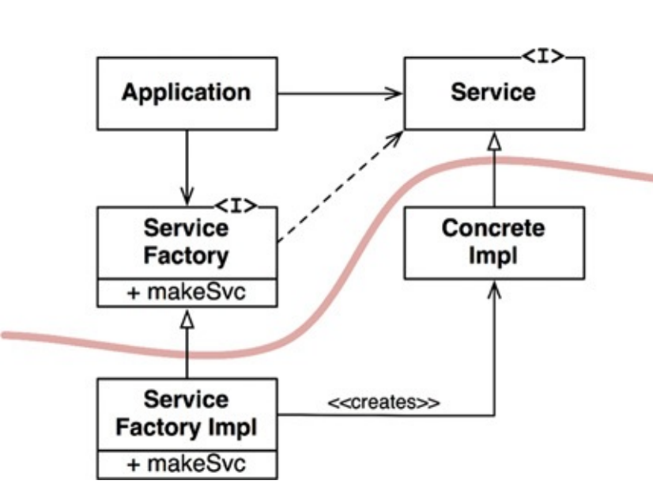

# Clean Architecture 

1. [Solid](#solid)
2. [Component Cohesion Principles](#component-cohesion-principles)
3. [Component Coupling Principles](#component-coupling-principles)
4. [GRASP](#grasp)

## SOLID

### Single Responsibility Principe
"A function/class/component should have *only one* reason to change"
The reason for the change is nothing but a change in the original responsibility of the software(function, class, component). 

*Hints*
- Function/Class/Interface name should represent what it does 

### The Open Closed Principle
A software artifact (function/class/component) should be open for extension but closed for modification.

*Hints*
- Accept Interfaces 

**In architecture** point of view you should be able to identify different layers of abstraction.
Examples:
  - Generating Layer
  - Authentication Layer
  - Processing Layer
  - Adapting Layer
  - Presentation Layer

### Liskov Substitution Principle
Superclass shall be replaceable with objects of its subclasses. 
That is almost certain with compile time checks but could lead to wrong abstractions

Example
In mathematics, a Square is a Rectangle. Indeed, it is a specialization of a rectangle. The "is a" makes you want to model this with inheritance.
However, if in code you made Square derive from Rectangle, then a Square should be usable anywhere you expect a Rectangle. This makes for some strange behavior.

Imagine you had SetWidth and SetHeight methods on your Rectangle base class; this seems perfectly logical.
However, if your Rectangle reference pointed to a Square, then SetWidth and SetHeight doesn't make sense because setting one would change the other to match it.
In this case Square fails the Liskov Substitution Test with Rectangle and the abstraction of having Square inherit from Rectangle is a bad one.

### Interface Segregation Principle
The general idea of interface segregation principle is that it’s better to have a lot of smaller interfaces than a few bigger ones.
“Make fine-grained interfaces that are client-specific. Clients should not be forced to implement interfaces they do not use.”

*In Architecture* point of view you should not depend on modules that contain more than you need. Split larger interfaces into smaller and more specific

#### Example of violation
Imagine that `User1` uses `op1`, `User2` uses `op2`, `User3` uses `op3` and `op1`, `op2`, `op3` are built under one artifact

That would lead to:
- If change is required to `op1`, `User2` and `User3` will be built also which is not needed
- These not necessary builds leads to big load on the whole CI/CD, a lot of PRs for version bumps and resource leaks
- Frequent

#### How to fix it
Using interfaces and appropriate client specific interfaces

*The lesson here is that depending on something that carries baggage that you don’t need can cause you troubles that you did not expect.*

### Dependency Inversion Principle
Dependency inversion principle means that developers should “depend on abstractions, not on concretions
High level modules should not depend upon low level modules. Both should depend on abstractions.

*Dependency Rule In Architecture point of view*
DIP is used when creating Architecture Boundaries.
Those boundaries separate software elements from one another, and restrict those on one side from knowing about those on the other. 
Boundaries between different parts of the system allow us to create independence between these parts, reducing coupling.
Decoupling different parts of the system like this is what allows flexibility.

## Component Principles
If the SOLID principles tell us how to arrange the bricks into walls and rooms, then the component principles tell us how to arrange the rooms into buildings.

### Component Cohesion Principles
Define when classes/modules should be used together in a component

Classes should be releasable together (RRP), have common reason to change (CCP) and be reused together (CRP)

#### Reuse/Release Principle
All classes/modules/struct which are within one component/package *should be releasable together*. They should have something that all share
Anything that we reuse must also be released and tracked.

#### Common Closure Principle
A component should not have multiple reasons to change
Gather together those things that *change at the same times and for the same reasons*. Separate
those things that change at different times or for different reasons.

Gather together those things that change at the same times and for the same reasons. Separate
those things that change at different times or for different reasons

*Usage*
- Separate classes into different components if they change for different reasons

#### Common Reuse Principle
CRP states that classes and modules that tend to be reused together belong in the same component.
Do not depend on things you do not need

*Usage*
- In such a component, we would expect to see classes that have lots of dependencies on each other.
- Put in one place components which are likely to change together

### Component Coupling Principles

#### The Acyclic Dependencies Principle
You should not have cycles in component dependency graph (diagram).
>The `go vet` does not allow on package level to do that.

*Problems*
- Multiple builds (CI/CD load) as when you release new version dependency should be updated and the cycle will do that infinitely
- Extensibility will suffer

##### How to resolve it
Applying the Dependency Inversion Principle

#### Stable Dependencies Principle
The principle addresses the *Changeability*

In this principle we identify different components:
- *Stable* Component - Which is designed not to be changed and should not depend on *flexible*. Example `String library` - *Responsible not to change*
- *Flexible* Component (Volatile) - Which is designed to be changeable `Higher level http metadata processing handler or presentation layer` - *Irresponsible*

Stability has measurements, and you can do deep analysis of your architecture on every level to find smells

*Formula*
Stability(I) = (Ce/Ca+Ce)
- I = 0 is Stable
- I = 1 is Unstable(Flexible)
>Ce = Efferent Coupling = Outgoing Dependencies
>Ca = Afferent Coupling = Ingoing Dependencies

“I” metric of a component should be larger than the “I” metrics of the components that it depends on.
The Stability should lower with the lower level components

*Violation*. 
We have designed a flexible component and we have started using it in a stable component which is smell.
Stable component should not depend on flexible ones, because it can produce more builds, releases and the consumers of the stable component will suffer
as they would be required to adapt

 

*How we can resolve that? Using Dependency Inversion Principle*
You can observe how we created and *Architecture Boundary* around `Interface - DIP`, 
so we have decoupled the stable and it's consumers from the lower logic level (Flexible and CA, CB, CD)  

#### Stable Abstraction Principle
The principle addresses the *Extensibility*

It is natural for every component to be changed so that leads to: Packages that are maximally *stable should be maximally abstract*. 
*Unstable packages should be concrete*.
- *Stable => Abstract* -  If it is stable, it is not expected to change, if it is not expected to change how it should be extended? We do that by applying OCP (Open for extension, closed for modification) using abstract classes or interfaces
- *Unstable(Flexible) => Concrete* - Unstable component should be concrete since it its instability allows the concrete code within it to be easily changed.

*Stability implies abstraction. Low level modules should not depend on higher level modules* 

### GRASP

